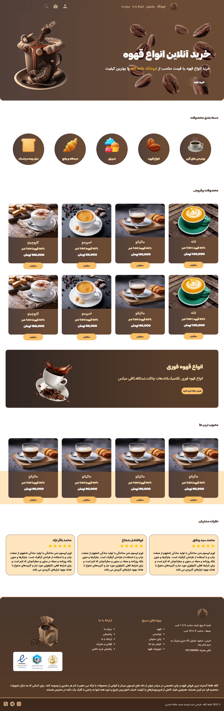

# Cafe Taha

A modern and responsive café website designed and developed from scratch using HTML, CSS, and jQuery, with a focus on custom UI, smooth interactions, and responsive user experience.

## About the Project

Cafe Taha is a portfolio project created to demonstrate my ability to design and develop a complete website from scratch without relying on pre-built frameworks.

The project focuses on creating a visually appealing café website with a custom interface, structured content, responsive layouts, and interactive elements.

Throughout the development process, I focused on creating a lightweight and organized front-end structure while paying attention to visual details, spacing, typography, animations, and responsive behavior.

## Key Features

* Modern café website design
* Fully responsive layout
* Custom user interface
* Built from scratch without a CSS framework
* Interactive elements using jQuery
* Smooth animations and transitions
* Structured and lightweight front-end
* Responsive design for different screen sizes
* Focus on visual details and user experience

## Technologies

* HTML5
* CSS3
* jQuery

## Screenshots

### Project Preview

### Screenshot 1

### Screenshot 2

### Screenshot 3

### Screenshot 4

### Screenshot 5

### Screenshot 6

### Screenshot 7

### Screenshot 8

---

# نسخه فارسی

## درباره پروژه

Cafe Taha یک وب‌سایت نمونه‌کار با موضوع کافه است که از صفر با استفاده از HTML، CSS و jQuery طراحی و توسعه داده شده است.

هدف این پروژه، نمایش توانایی من در طراحی و پیاده‌سازی یک وب‌سایت کامل و سفارشی بدون استفاده از فریم‌ورک‌های آماده بوده است.

در طراحی این وب‌سایت تلاش کردم یک رابط کاربری جذاب و منظم ایجاد کنم و در کنار ظاهر بصری، روی ریسپانسیو بودن، تعاملات، انیمیشن‌ها، فاصله‌گذاری و جزئیات رابط کاربری تمرکز داشته باشم.

## ویژگی‌های کلیدی

* طراحی مدرن برای وب‌سایت کافه
* کاملاً ریسپانسیو
* رابط کاربری کاملاً سفارشی
* پیاده‌سازی از صفر بدون استفاده از فریم‌ورک CSS
* استفاده از jQuery برای تعاملات
* انیمیشن‌ها و ترنزیشن‌های نرم
* ساختار سبک و منظم در فرانت‌اند
* سازگاری با اندازه‌های مختلف صفحه
* توجه به جزئیات بصری و تجربه کاربری

## تکنولوژی‌های استفاده‌شده

* HTML5
* CSS3
* jQuery

## تصاویر پروژه

### پیش‌نمایش پروژه

### تصویر اول

### تصویر دوم

### تصویر سوم

### تصویر چهارم

### تصویر پنجم

### تصویر ششم

### تصویر هفتم

### تصویر هشتم

## هدف از ساخت

هدف از ساخت این پروژه، تقویت و نمایش مهارت‌های من در طراحی و توسعه فرانت‌اند و ایجاد یک وب‌سایت کامل و سفارشی از ابتدا بوده است.

در این پروژه تلاش کردم بدون استفاده از فریم‌ورک‌های آماده، یک رابط کاربری منظم، سبک و ریسپانسیو ایجاد کنم و در کنار کدنویسی، به جزئیات بصری و تجربه کاربری نیز توجه داشته باشم.
